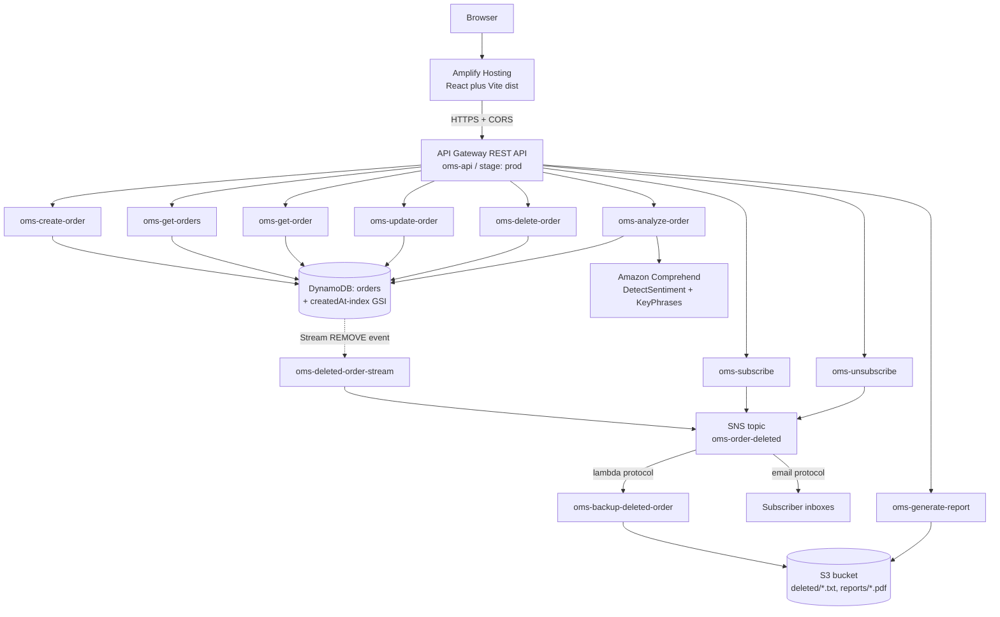

# Event-Driven Serverless Order Management System

AWS final project (Part B) — architecture and build plan.

English master document (architecture, API table with samples, CLI per service): [MASTER.md](MASTER.md).

Frozen HTTP contract for the React client: [API_CONTRACT.md](API_CONTRACT.md).

Design and then build an event-driven serverless Order Management System on the AWS
Learner Lab: API Gateway + Lambda over DynamoDB, with DynamoDB Streams driving
asynchronous SNS email notifications and S3 TXT backups on delete, an on-demand PDF
summary, Amazon Comprehend as the freestyle enhancement, and a React + Vite client on Amplify.

## Architecture

The delete path is the heart of the design. `oms-delete-order` does nothing but
`DeleteItem` and return `200` — it never calls SNS or S3, so the user's response is never
delayed. DynamoDB Streams then emits a `REMOVE` record carrying the full `OldImage`,
which triggers `oms-deleted-order-stream`. That function publishes one formatted message
to the SNS topic, and SNS fans it out two ways: to every confirmed email subscriber, and
to `oms-backup-deleted-order`, which writes the same text to S3 as a `.txt` file.
Notification and backup are therefore independent — one failing cannot affect the other
or the delete response.

## Data model

Table `orders`, on-demand billing, `StreamViewType=NEW_AND_OLD_IMAGES`.

- Partition key: `orderId` (String, UUIDv4). Chosen over a composite key because "get a
  specific order" and "delete order" receive only the ID, so a single-attribute key allows
  a direct `GetItem`/`DeleteItem` (1 RCU, no query). A UUID also spreads writes evenly
  across partitions, unlike a sequential counter.
- Attributes: `createdAt` and `lastModified` (ISO-8601 UTC strings, lexicographically
  sortable), `price` (Number), `description` (String), `entityType` (constant `"ORDER"`),
  plus `sentiment` / `keyPhrases` written by the Comprehend enhancement.
- GSI `createdAt-index`: partition key `entityType`, sort key `createdAt`. This is the
  justification for the "sort key" requirement — "get all orders sorted by creation date"
  becomes a single `Query` on one partition with `ScanIndexForward`, instead of a `Scan`
  plus in-memory sort, so it stays correct and cheap as the table grows.

## AWS resources

Region `us-east-1`; all Lambdas use the Learner Lab `LabRole`.

- DynamoDB table `orders` with streams enabled
- SNS topic `oms-order-deleted`
- S3 bucket `oms-orders-<ACCOUNT_ID>` (globally unique), prefixes `deleted/` and
  `reports/`, block-public-access ON — the PDF is delivered via a presigned URL, not a
  public object
- API Gateway REST API `oms-api`, Lambda proxy integration, CORS enabled on every resource
- 11 Lambda functions (Python 3.12)
- Lambda layer `oms-pdf-layer` containing `fpdf2` (pure Python, so it zips cleanly from
  Windows — unlike `reportlab`, which ships C extensions)
- Amplify Hosting app `oms-client`: React + Vite production build (`dist/`), not localhost
- Amazon Comprehend (no resource to create, IAM-only access)

## API surface

- `POST /orders` — body `{description, price}` → created order
- `GET /orders` — Query on `createdAt-index`, newest first
- `GET /orders/{orderId}`
- `PUT /orders/{orderId}` — updates `description`/`price`, refreshes `lastModified`
- `DELETE /orders/{orderId}` — returns immediately
- `POST /notifications/subscribe` — body `{email}` → `sns:Subscribe`, returns
  pending-confirmation notice
- `POST /notifications/unsubscribe` — body `{email}` → `ListSubscriptionsByTopic`, match
  endpoint, `sns:Unsubscribe`
- `GET /reports/deleted-orders` — reads every `deleted/*.txt`, builds a PDF, uploads to
  `reports/`, returns `{"url": "<presigned>"}` in the body
- `POST /orders/{orderId}/analyze` — freestyle: Comprehend `DetectSentiment` +
  `DetectKeyPhrases` on the description, persists the result, returns it

Two constraints worth knowing up front: an SNS email subscription stays in
`PendingConfirmation` until the recipient clicks the confirmation link (and cannot be
unsubscribed by ARN while pending), and the Learner Lab does not allow creating IAM roles,
so every function must be attached to the existing `LabRole`.

## Freestyle enhancement

Each order card in the UI gets an "Analyze description" button. It calls
`POST /orders/{orderId}/analyze`, which sends the description to Amazon Comprehend and
returns a sentiment label with its confidence score plus the extracted key phrases. The
result is written back onto the DynamoDB item, so it renders as a colored sentiment badge
and a row of phrase tags on every later page load. This turns free-text order descriptions
into structured, filterable signal — useful for spotting complaint-toned orders.

## Deliverable assembly

Everything the Word document needs is produced as we go: the diagram above, a per-service
justification plus a verified `aws ... describe/list` CLI command for each resource, the
API table with real sample requests and responses, the Amplify URL, the `oms-delete-order`
source, and screenshots from a scripted list of test flows.

## Build order

1. Review the architecture and data model, then write the diagram and design-explanation
   section for the Word deliverable.
2. Create the local project structure: `lambdas/`, `client/`, `layer/`, `scripts/`, `docs/`.
3. Provision core infrastructure via AWS CLI script: DynamoDB `orders` table with
   `createdAt-index` GSI and streams, S3 bucket, SNS topic `oms-order-deleted`.
4. Write and deploy the five CRUD Lambdas (create, get-all via GSI Query, get-one, update,
   delete) with shared response/CORS helpers.
5. Create the `oms-api` REST API, wire proxy integrations for all resources, enable CORS,
   deploy the `prod` stage.
6. Implement subscribe/unsubscribe Lambdas against SNS and verify the email confirmation
   flow.
7. Implement `oms-deleted-order-stream` (DynamoDB Streams REMOVE trigger to SNS publish)
   and `oms-backup-deleted-order` (SNS to S3 TXT); verify delete latency is unaffected.
8. Build the `fpdf2` Lambda layer and `oms-generate-report`, returning a presigned S3 URL
   in the response body.
9. Implement `oms-analyze-order` using Comprehend `DetectSentiment` and
   `DetectKeyPhrases`, persisting results to the order item.
10. Build the React + Vite client covering all endpoints including the analyze button, and
    deploy the `dist/` output to Amplify Hosting.
11. Assemble the Word deliverable: service table with runnable CLI commands, API table with
    samples, tested-flow screenshots, freestyle explanation, delete Lambda code.
